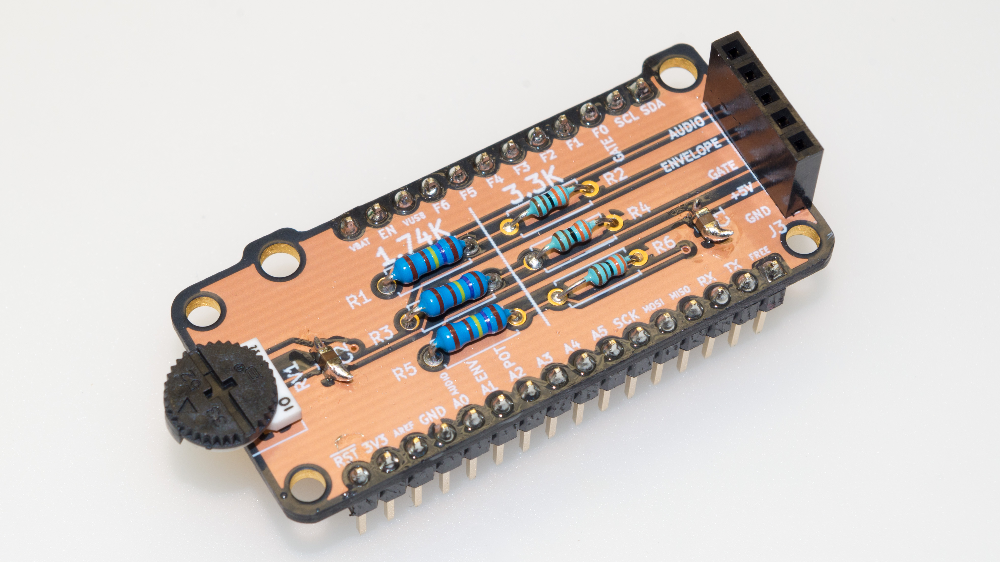

This repository contains [KiCad][1] 5 files for a [FeatherWing][2]
board which lets you plug in a [SparkFun Sound Detector][3] and use it
with a Feather.  It runs the Sound Detector at 5V, and then has
voltage dividers to convert the output signals to 3.3V, for use by the
Feather.

The "audio" analog signal is connected to feather pin A0, the
"envelope" analog signal is connected to feather pin A1, and the
"gate" digital signal is connected to the feather pin that
[I call F0][4].  There is also a potentiometer connected to feather
pin A2, which can be used, for example, if you want to implement an
adjustable threshold in software (rather than using the Sound
Detector's "gate" signal).

The board has three M2.5 mounting holes which should line up with the
Feather, and two M3 mounting holes which should line up with the Sound
Detector. There are optional places for two SMT decoupling capacitors.

SparkFun recommends running the Sound Detector at 5V, rather than
3.3V, so the Sound Detector is powered from the Feather's VUSB pin, to
get a solid 5V supply.  A consequence of this is that *this
FeatherWing will not work on battery power*; you must have USB plugged
in for power.

* [View schematic](SoundDetectorWing.pdf)
* [Order board on OSH Park][5] (photo shows the OSH Park "after dark" option)

## Bill of Materials

| Ref        | Description                      | MPN              | Digi-Key PN              |
| ---------- | -------------------------------- | ---------------- | ------------------------ |
| C1, C2     | CAP CER 10UF 10V X5R 0805        | C0805C106K8PACTU | [399-4925-1-ND][C1]      |
| J1         | 16-pin male header 2.54mm        |                  |                          |
| J2         | 12-pin male header 2.54mm        |                  |                          |
| J3         | CONN HDR 5POS 0.1 GOLD PCB       | PPPC051LFBN-RC   | [S7038-ND][J3]           |
| R1, R3, R5 | RES 1.74K OHM 1/4W 1% AXIAL      | MFR-25FBF52-1K74 | [1.74KXBK-ND][R1]        |
| R2, R4, R6 | RES 3.3K OHM 1/4W 1% AXIAL       | RNMF14FTC3K30    | [S3.3KCACT-ND][R2]       |
| RV1        | POT 10K OHM THUMBWHEEL CERM ST   | 3352T-1-103LF    | [3352T-103LF-ND][RV1]    |

[C1]: https://www.digikey.com/products/en?keywords=399-4925-1-ND
[J3]: https://www.digikey.com/products/en?keywords=S7038-ND
[R1]: https://www.digikey.com/products/en?keywords=1.74KXBK-ND
[R2]: https://www.digikey.com/products/en?keywords=S3.3KCACT-ND
[RV1]: https://www.digikey.com/products/en?keywords=3352T-103LF-ND

[1]: http://kicad-pcb.org/
[2]: https://learn.adafruit.com/adafruit-feather/feather-specification
[3]: https://www.sparkfun.com/products/12642
[4]: https://funwithsoftware.org/posts/2018-08-31-feather-ascii-art-pinout.html
[5]: https://oshpark.com/shared_projects/fDlbdMGa
